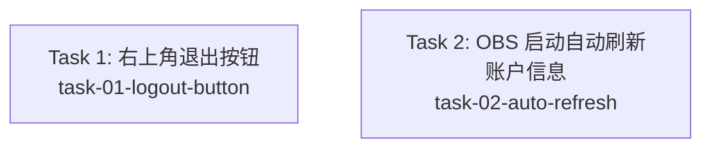

# DAG：账号退出按钮 + OBS 启动时自动刷新账户信息

## 依赖图

两个任务无逻辑依赖，共享 `bili-dock.h` 和 `bili-dock.cpp` 但修改不同区域，可并行实现。

## 任务清单

| 任务 ID | 名称 | 标签 | 依赖 | 涉及文件 |
|---------|------|------|------|----------|
| task-01-logout-button | 右上角退出登录按钮 | frontend | 无 | `bili-dock.h`, `bili-dock.cpp` |
| task-02-auto-refresh | OBS 启动时自动刷新账户信息 | backend | 无 | `bili-dock.h`, `bili-dock.cpp`, `plugin-main.cpp` |

## 共享文件冲突分析

| 文件 | Task 1 修改 | Task 2 修改 | 冲突风险 |
|------|------------|------------|----------|
| `bili-dock.h` | 新增 `btn_header_logout_` 成员 | 新增 `refresh_account_info()` 声明 | 低（不同行） |
| `bili-dock.cpp` | `init_ui()`, `on_login_done()`, `set_logged_out()`, `do_logout()`, `refresh_account_list()` | 新增 `refresh_account_info()` 实现 | 低（不同函数） |

## 参考文档

- **PRD**: `docs/prd/account-logout-and-refresh.md`
- **技术方案**: `docs/dev/specs/account-logout-and-refresh.md`
- **Parent Issue**: [#1](https://github.com/devcxl/bilibili_live_obs_plugin/issues/1)
