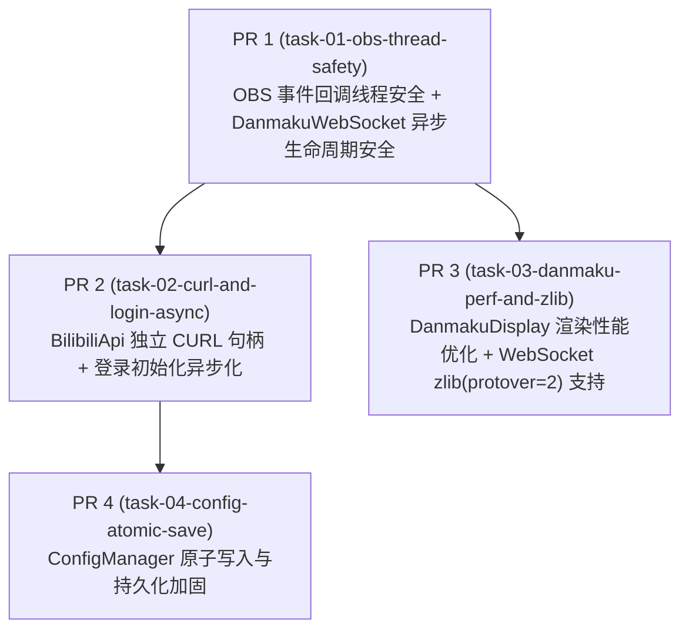

# DAG：代码缺陷修复与稳定性加固任务规划

## 依赖图

## 任务清单与 PR 映射

| 任务 ID | 对应 PR | 优先级 | 影响模块 | 涉及文件 |
|---------|---------|--------|----------|----------|
| `task-01-obs-thread-safety` | PR 1 | **P0** | OBS 事件分发、弹幕生命周期 | `src/plugin-main.cpp`, `src/danmaku-ws.h`, `src/danmaku-ws.cpp` |
| `task-02-curl-and-login-async` | PR 2 | **P0/P1** | 网络层、鉴权服务 | `src/bilibili-api.h`, `src/bilibili-api.cpp`, `src/auth-service.cpp` |
| `task-03-danmaku-perf-and-zlib` | PR 3 | **P1** | 弹幕渲染、WebSocket 协议 | `src/danmaku-display.h`, `src/danmaku-display.cpp`, `src/danmaku-ws.cpp`, `CMakeLists.txt` |
| `task-04-config-atomic-save` | PR 4 | **P1/P2** | 配置管理 | `src/config-manager.h`, `src/config-manager.cpp` |

## 任务详细说明

### Task 1: OBS 事件回调线程安全 + DanmakuWebSocket 异步生命周期安全 (PR 1)
- **目标**：彻底消除崩溃与 UAF 隐患
- **内容**：
  1. `plugin-main.cpp` 中将 `on_obs_streaming_started` / `stopped` 回调通过 `obs_queue_task(OBS_TASK_UI, ...)` 投递至 Qt UI 线程执行。
  2. 改造 `DanmakuWebSocket::connect_to_room` 的异步机制，确保后台请求持有 shared context 或在析构时安全取消/等待，消除 `destroy_services()` 时的悬挂指针与析构卡死。

### Task 2: BilibiliApi 独立 CURL 句柄 + 登录初始化异步化 (PR 2)
- **目标**：消除 UI 线程网络锁死与句柄状态污染
- **内容**：
  1. 移除 `BilibiliApi` 中的单一 `curl_` 成员与垄断性 `api_mutex_`，每次请求独立创建/复用局部句柄并确保清理。
  2. 扫码成功后的 `fetch_room_id`、`fetch_full_user_data` 与分区拉取流程异步化，防止 UI 定时器槽函数假死。

### Task 3: DanmakuDisplay 渲染性能优化 + WebSocket zlib 支持 (PR 3)
- **目标**：解决高频弹幕掉帧卡顿与协议兼容
- **内容**：
  1. 改造 `DanmakuDisplay`，避免为每条弹幕创建 `QLabel` Widget，降低 UI 渲染与内存开销。
  2. 在 `DanmakuWebSocket::parse_packet_loop` 中补充 `protover == 2`（zlib/deflate）解压分支。

### Task 4: ConfigManager 原子写入与持久化加固 (PR 4)
- **目标**：防止异常退出时配置损坏与丢失
- **内容**：
  1. `ConfigManager::save()` 改造为临时文件写入 + fsync + rename 原子操作。
  2. 修正密钥派生算法注释与异常捕获逻辑。
