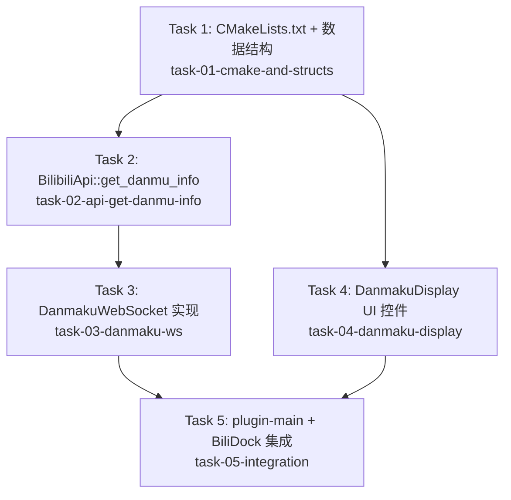

# DAG：推流线路下方添加实时弹幕展示

## 依赖图

## 任务清单

| 任务 ID | 名称 | 标签 | 依赖 | 涉及文件 |
|---------|------|------|------|----------|
| task-01-cmake-and-structs | CMakeLists.txt 变更 + 公共数据结构定义 | backend | 无 | `CMakeLists.txt`, `src/danmaku-ws.h`（结构体部分） |
| task-02-api-get-danmu-info | BilibiliApi::get_danmu_info() HTTP API 实现 | backend | task-01 | `src/bilibili-api.h`, `src/bilibili-api.cpp` |
| task-03-danmaku-ws | DanmakuWebSocket 客户端完整实现 | backend | task-01, task-02 | `src/danmaku-ws.h`, `src/danmaku-ws.cpp` |
| task-04-danmaku-display | DanmakuDisplay UI 控件实现 | frontend | task-01 | `src/danmaku-display.h`, `src/danmaku-display.cpp` |
| task-05-integration | plugin-main.cpp + BiliDock 总装集成 | frontend | task-01, task-03, task-04 | `src/plugin-main.cpp`, `src/bili-dock.h`, `src/bili-dock.cpp` |

## 共享文件冲突分析

| 文件 | Task 1 | Task 2 | Task 3 | Task 4 | Task 5 | 冲突风险 |
|------|--------|--------|--------|--------|--------|----------|
| `CMakeLists.txt` | 新增依赖/源文件 | — | — | — | — | 低（唯一修改者） |
| `src/danmaku-ws.h` | 结构体部分 | — | 完整类定义 | — | — | 中（同一文件不同区域，需顺序合并） |
| `src/bilibili-api.h` | — | 新增方法声明 | — | — | — | 低（唯一修改者） |
| `src/bilibili-api.cpp` | — | 新增实现 | — | — | — | 低（唯一修改者） |
| `src/plugin-main.cpp` | — | — | — | — | 新增全局变量+初始化 | 低（唯一修改者） |
| `src/bili-dock.h` | — | — | — | — | 新增成员+方法 | 低（唯一修改者） |
| `src/bili-dock.cpp` | — | — | — | — | UI 布局+信号+联动 | 低（唯一修改者） |

## 并行执行策略

- Task 1 完成后，Task 2 和 Task 4 可并行
- Task 3 等待 Task 2 完成
- Task 5 等待 Task 3 和 Task 4 完成

## 参考文档

- **PRD**: `docs/prd/` （缺少独立 PRD，需求在 task 描述中）
- **技术方案**: `docs/dev/specs/danmaku-display.md`
- **ADR**: `docs/adr/2026-07-25-danmaku-websocket.md`
- **Parent Issue**: [#6](https://github.com/devcxl/bilibili_live_obs_plugin/issues/6)
